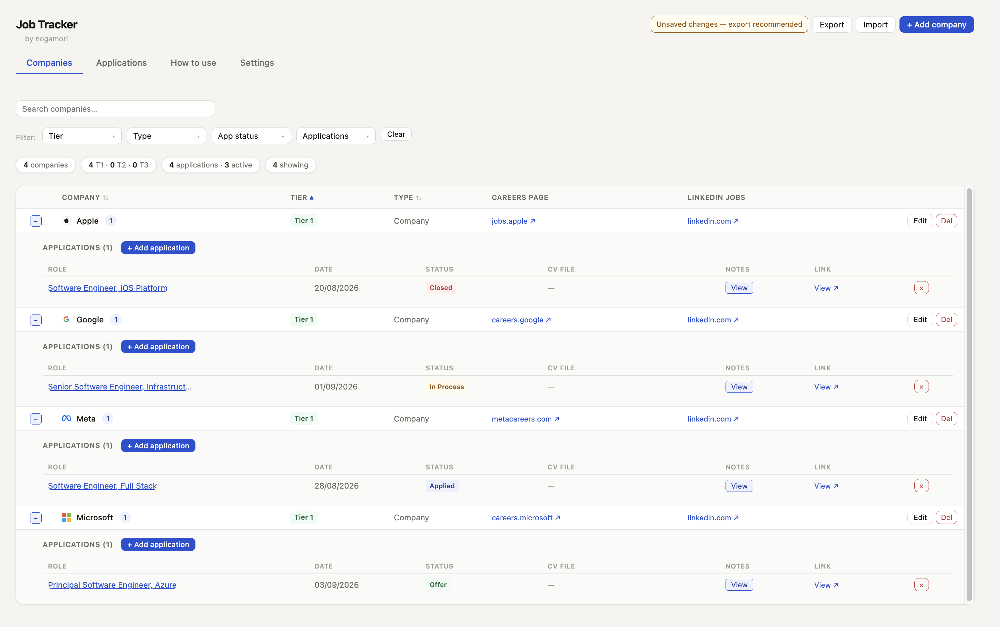
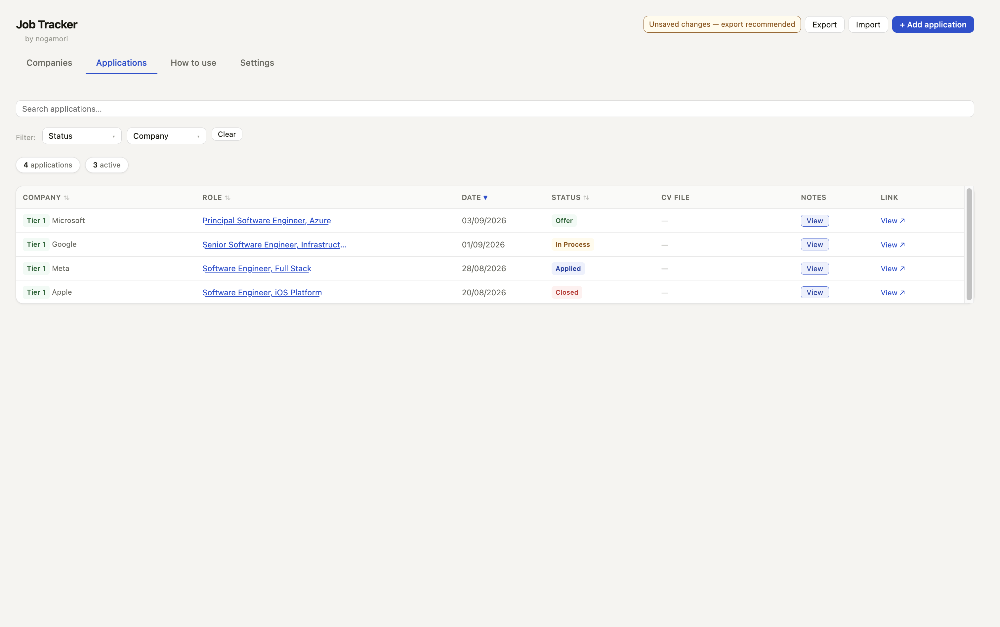
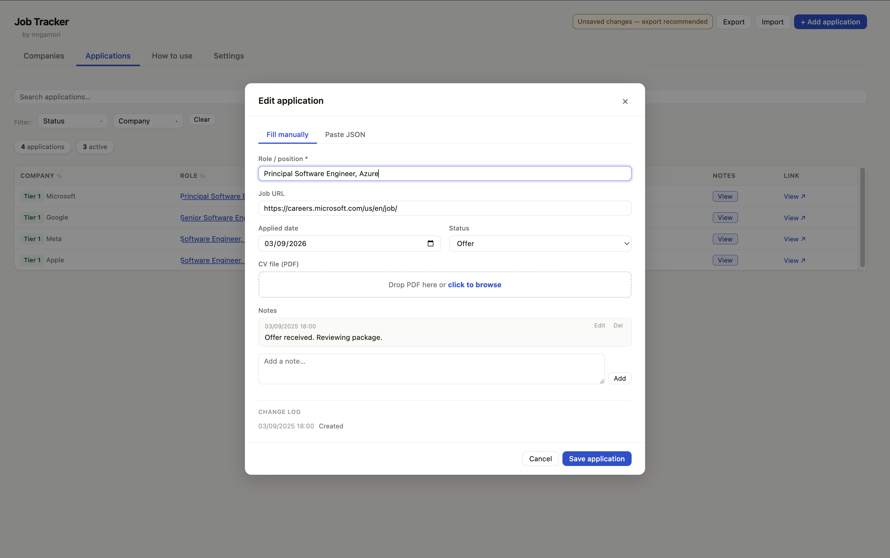
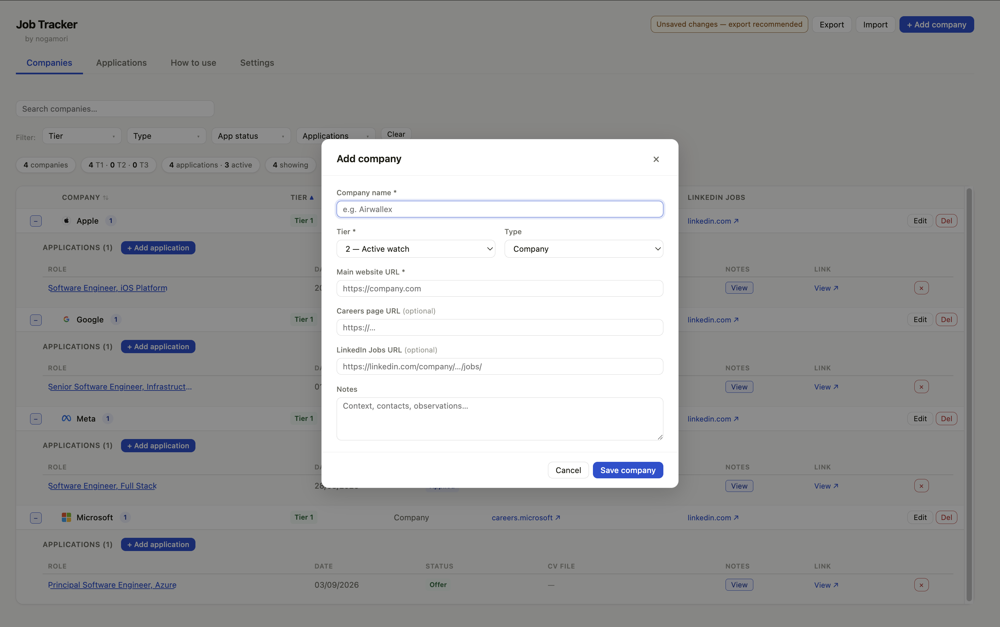

# Job Tracker

A self-contained, single-file web app to track job applications across companies, agencies, and job platforms — with no installation, no server, and no account required.

---

## Features

- Track companies, agencies, and job platforms in one place
- Log applications with status, CV file (PDF stored as base64), and timestamped notes
- Full changelog for every application edit
- Import and update applications via JSON — partial updates supported
- Bulk import companies via JSON
- Filter and sort by tier, type, status, and more
- Sticky header with table-only scroll in Companies and Applications views
- Custom tiers and application statuses via Settings
- Automatic dark mode (follows OS preference)
- Export and import all data as a single JSON backup file

---

## How it works

All data is stored locally in your browser using **IndexedDB**. Nothing is sent to any server. The app works fully offline after the first load.

The JSON export is your backup — keep it alongside the HTML file and import it whenever you open the app in a new browser or device.

## Getting started

1. Download [`job_tracker.html`](https://github.com/nogamori/job-hunting-tracker/raw/main/job_tracker.html)
2. Open it in any modern browser (Chrome, Brave, Firefox, Safari, Edge)
3. Add companies using **+ Add company** or import a JSON file via **Import**
4. When you apply to a role, click **+** next to the company to log the application
5. Update status and add notes as the process evolves
6. Export your data regularly — it lives in the browser, not in the HTML file

## Updating

When a new version of `job_tracker.html` is released:

1. Export your data (click **Export**)
2. Download the new `job_tracker.html`
3. Open it and click **Import** to restore your data

## Data format

The export file (`job_tracker_data.json`) is a plain JSON file. You can edit it manually or generate updates programmatically — useful for integrating with AI assistants that can produce partial update JSON to paste directly into the app.

See the **How to use** tab inside the app for the full JSON format reference and AI prompt templates.

## Contributing

Bug reports and feature requests are welcome via [Issues](https://github.com/nogamori/job-hunting-tracker/issues).

## License

MIT — see [LICENSE](LICENSE) for details.

---

*Built by [@nogamori](https://github.com/nogamori) with [Claude AI](https://claude.ai) by Anthropic.*
